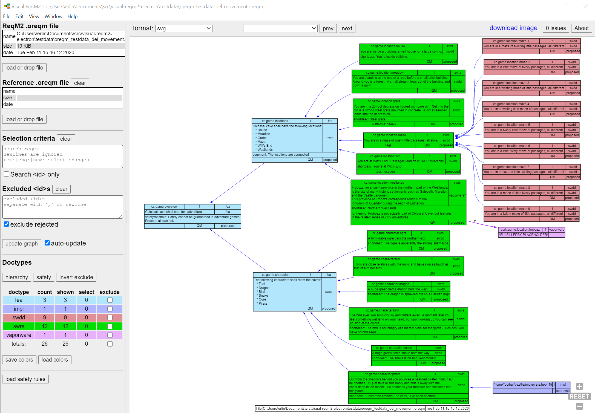
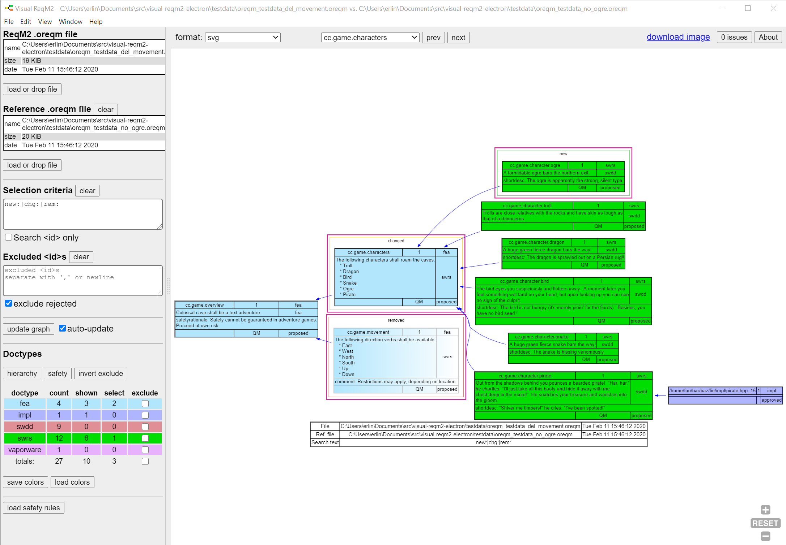

# Visual ReqM2

Visual ReqM2 is an electron app that generates visualizations of requirements hierarchies.

The input is one or two `.oreqm` files generated by ReqM2.

The application displays a diagram created in the Graphviz 'dot' language.

It can visualize requirements from a single `.oreqm` file, or make a diagram representation of the
differences between two `.oreqm` files.

## Running the application

Under 'releases' there are binaries for Windows and Linux, which can directly be installed.
There are also "stand-alone" executables, which do not integrate in menus or associate with `.oreqm` files.

For Windows it is the excutable *without* 'Setup' in its name, and for Linux it is the `.AppImage` executable.

## Building the application

Should you wish to build this, it is necessary to have nodejs installed (currently version v14.0.9)
as well as npm (currently version 6.14.8).

As javascript is an evolving language, the source code is transpiled to an older (simpler/uglier) format,
which is then executed. This is to be compatible with some of the used modules.
This means that the source code that is visible in the chrome debugging tool is close, but not exactly what is
found in the scripts folder.

```bash
npm install
# transpile js and start application
npm run-script build
npm start

```

### Building binaries for Windows
To build a Windows executable to the following step (on a Windows machine)

```bash
npm run-script win
# this will create an electron applications for Windows (installable and stand-alone)
# './dist/Visual ReqM2 Setup 0.98.2.exe'
```

#### Windows signing
For Windows there are some optional signing configuration.
You will need to provide your own certificate and associated password
The signing is necessary for the auto-update feature to work, but this feature is default off.
The signing for Windows is configured with two environment variables. See https://www.electron.build/code-signing for details.
```bash
CSC_KEY_PASSWORD=somesecretpasswordwhichisnotthisone
# Define path to certificate
CSC_LINK=~/certs/app_cert.pfx
```

### Building binaries for Linux
To build a Linux executable to the following step (on a Linux machine)

```bash
npm run-script linux
# this will create .rpm , .dep and .AppImage binaries
# './dist/Visual ReqM2 Setup 0.98.2.AppImage'
```

Read about testing and tracing in [TEST_AND_TRACE.md](./doc/TEST_AND_TRACE.md).


## Quick start

The program can be launched without parameters or can accept one or two `oreqm` files on the command line.

### Drag and drop

The `.oreqm` files can be dragged to the input areas for main oreqm file and reference oreqm file respectively.
These areas are in the upper left corner of the main window.

### If no diagram appears

For very complex diagrams the viz.js/graphviz module can take take a very long time to compute a layout.
This is not even guaranteed to succeed.

If the program is not producing a diagram, consider disabling one or more less important doctypes, by
exluding them from the doctype table. This can be done at any time.

In the doctype table it is visible how many nodes an exclusion of a doctype would eliminate from the diagram.
The doctype table is the colorful table in the lower left of the main window.

## Search

The whole point of this application is to quickly focus on nodes of particular interest and have an overview
of the contexts they appear in, and not be distracted by irrelevant data. To achieve this, selection and
pruning of the graph of nodes is wanted.

### Search terms

When no search terms are defined, Visual ReqM2 will try to display all nodes. This may not always be a good
strategy, as some projects can have many thousands of nodes/requirements.

Visual ReqM2 has a setting for the maximum number of nodes in a diagram. the default is 1000 nodes.
An indication will be shown when this limit is exceeded.

At least the author believes that a diagram with more than 1000 nodes is not helping with the overview
that this program aims to provide. So if too many nodes are rendered, make the filters more precise.

### Filter Mechanisms

There are three main ways to filter requirements:

* by `doctype`
* **select** specific nodes (and also show nodes that are reachable from selected nodes)
* **exclude** specific nodes (breaks reachability)

These filter mechanisms will be explained below:

#### Doctypes

Each requirement/node belongs to a `doctype`. The application associates each `doctype` with a particular color.

The doctype table has checkboxes to disable display of selected doctypes. For example `impl` doctypes rarely have
interesting information, it is their presence that counts, so the user may choose not to clutter the diagram
and exclude them.

The doctype table shows how many nodes of each doctype are present in the `.oreqm` file, how many are shown
and how many are currently selected.

### Selecting nodes

The **Selection criteria** text box to the left accepts a **regular expression**. Nodes which match this
expression will be shown and highlighted with a <span style="color:darkred">maroon</span> outline.
Furthermore, all nodes reachable from these **selected** nodes will also be shown. All other nodes are left out.
The regular expression can be applied to the \<id> only, or to a **combined** string.

The combined string concatenates the raw text from xml tags with some prefixes in the order below, separated by newlines.

* `dt:<doctype>`
* `de:<description>`
* `fi:<furtherinfo>`
* `rt:<rationale>`
* `sr:<safetyrationale>`
* `sc:<safetyclass>`
* `sd:<shortdesc>`
* `uc:<usecase>`
* `vc:<verifycrit>`
* `co:<comment>`
* `cs:<covstatus>`
* `tag:<tag>`
* `plt:<platform>`
* `id:<id>`

**Note**: The `<id>` is deliberately the last item in this string. This means that a regex ending
with `$` will match a specfic `<id>` and not all \<id>s with a common prefix.

**Note**: When doing comparisons of two `.oreqm` files, the `<id>` text is prefixed with `rem:`, `chg:`
and `new:` for **removed**, **changed** and **new** nodes respectively.

**Note**: It is possible to locate requirements with `fulfilledby` links, by using the text search
prefix `ffb:` for the referred \<id>, or just `ffb:` to select them all.

**Note**: It is possible to search for text in specific fields, by constructing a search string that
respects the order of fields listed above and separating the search elements with a wildcard match `.*` .

For example match requirements of \<safetyclass> 'SIL-2' with the word
'kernel' in the \<id> using this search string: `sc:sil-2.*id:.*kernel`

The search is case-insensitive.

Nodes can also be selected by right-clicking them and choosing 'Select' in the context menu. This will update
the regex in the **Selection criteria** box. All additional nodes reachable from the selected node, will be added to diagram.

Similarly an explicitly **selected** node can also be **de-selected** again from the right-click menu.
It is not possible to deselect nodes that were matched with anything but a specific `<id>$`.

**Note**: the Visual ReqM2 specific right-click menu only works in `svg` mode, i.e. not if the diagram is 
displayed as png file.

### Excluding nodes

The "Excluded \<id>s" text box contains full \<id>s of nodes that are excluded, one \<id> per line.

An excluded node is not shown and the and anything beyond it is not reachable from
selected nodes.
A right-click on a node opens a context menu with the option to exclude the node.

To un-exclude the node it is necessary to delete the relevant entry in the "Excluded \<id>s" box.

It is possible to exclude all nodes with \<status>rejected\</status> with the `exclude rejected`
checkbox (this is the default).

### Duplicate \<id>s

Normally \<id>s are globally unique, but ReqM2 permits duplicate \<id>s with certain options selected.
In this situation it is the expectation that \<id> + \<version> together is unique.
When Visual ReqM2 encounters such duplicates, the **internal key**, which is normally identical to the **\<id>**,
will become the **\<id>:\<version>** from 1st detected duplicate and onwards.
This has the effect that when excluding nodes, it is the **key** which is put in the exclusion box, and for duplicates
it may have a suffix with ':' and \<version>.

### Copy \<id> or other text from nodes to clipboard

The right-click menu has an option that puts the \<id> on the clipboard. Also the fulfilledby style
\<id>:\<doctype>:\<version> is directly available.

This is only possible when **svg** format is in use (which is the default).

### Update and auto-update

When loading an `.oreqm` file the full graph will be shown automatically, but the number of nodes
is limited to the configurable number of 1000 (which can be changed in settings).
For larger graphs the `auto-opdate` option can be turned off, and clicking the "Update graph" button is then
necessary to update diagram (otherwise editing search criteria, exclusions or doctype filters will trigger a redraw).

The underlying graph generation tool, "Graphviz/viz.js" is limited in how big graphs it can render,
and processing time also grows with graph size.

While the graph is beingn calculated a spinner is shown. The Graphviz processing happens in
a worker thread, so selection criteria can be updated while this is going on.

It is possible to use "auto-update" regardless of the size of the graph, but responsiveness may
suffer when many nodes need to be rendered.

When a suitably small graph has been defined though selections and/or exclusions, it is a good idea
to re-enable "auto-update".

### Comparing oreqm files

A reference `.oreqm` file can be loaded. This is expected to be a file **older** than the main one, in
terms of what is categorized as **new** vs. **removed**.

Nodes which are **new**, **changed** or **removed** are shown with an outline around them in green, orange or red.

It is possible to select these nodes with a regex expressions. A hidden prefix `new:`/`chg:`/`rem:` is added to their
\<id> as described above. In the future this marker may be moved to a separate tag.

## Viewing the doctype relationships

The `hierarchy` button will calculate the overall relationships between **doctypes** and display a diagram
with one node per doctype. The number of specobjects of each doctype is displayed, and the connecting lines
show the nature and count of the relations to the other doctypes.
Currently no filtering operations are possible on this diagram.
Return to the main diagram by clicking the `update graph` button.

## Viewing safetyclass links

The `safety` button will display a diagram similar to the `hierarchy` diagram. What is additionally done is to
consider the safetyclasses of the linked specobjects.

Each doctype is represented by a box with its associated color. The total number of specobjects is
listed along with the count of each safetyclass represented by specobjects of this doctype.

There are arrows indicating providescoverage/linksto relations and stippled arrows for fulfilledby relations.
**GREEN** arrows are supposed to indicate permitted relations and **RED** arrows to indicate relations that are violating 
safety rules.

Visual ReqM2 has a log of various problems detected. This is accessible through the `issues` button in the upper
right corner.

### Configuration of safety rules

Now, Visual ReqM2 does not know all there is to know about safety rules, but it provides a mechanism to configure
permitted links based on \<doctype> and \<safetyclass> of the specobjects at the ends of a link.

Visual ReqM2 will construct a string for each relation with doctype and safetyclass for each end of the relation.
Each **"doctype:safetyclass>doctype:safetyclass"** string will then be tested against an array of **regular expressions**,
until one of them match, or all expressions have failed.

The **'>'** character shall be read as "provides coverage to", and the **':'** character is the separator between
\<doctype> and \<safetyclass> strings. 

Fulfilledby links are considered 'in reverse direction' to aligh with this logic.

If the string is matched, it is considered a valid link, but if no match is found, the link is invalid, and it is
reported as an issue and a RED arrow is added to in the diagram between the relevant doctype nodes.

For each arrow in the diagram there is a count of the instances, i.e how may specobjects have this relation.

The details of safety violations are written to the list of `issues`. This is a text log, which is accessible
via the `issue` button in the upper right corner or through the menu 'View' -> 'Show issues'.
Here the pairs of names of the individual failed specobject relations, are listed.

The `issues` dialog allows to save the text as a file and to clear the buffer.

The analysis of the safety relations is done whenever the `safety` button is pressed.
Notice that the diagram lists the regular expressions used to evaluate the 'correctness' of the safety relations.

The array of regular expressions can be loaded from a `.json` file (it is an array of strings with javascript
regex syntax).
The array of expressions can also be edited from the settings dialog. Use Menu "Edit" ->  "Settings..." to access.

When settings are modified, they are made persistent, so the next start of the program should have the same settings.

## Output

Aside from the obvious output on the display, there are mechanisms to save and use the generated diagrams.

The default output format is `.svg`. Output can also be generated in `.png` format and in `.dot` format.
The latter is mostly for debugging problems with the generation of diagrams.

From file menu click "Save diagram as...". Specifying either a `.svg`, `.png` or `.dot` extension for
the filename controls the output format.

The same functionality is also available from the right-click context menu as "Save diagram as..."

For easy pasting of diagrams to chat tools and similar, it is also a possibility to right-click and select "Copy diagram as PNG".

There is currently no support for SVG images on the clipboard.

### How nodes are displayed

The text in specobjects is often written with various docbook/xml markup. `Graphviz` cannot render this
markup, and readability of the requirement suffers from the markup. Therefore heuristics are applied to
remove the markup and implement simple versions of list rendering.
The text shown is **not** an accurate representation of docbook markup.
There is no attempt to reflow text, except from breaking up lines longer than 110 characters.

### Colors and doctypes

Each doctype is assigned its own color. It is possible to load a color scheme, which is a simple JSON map
from doctype name to hex RGB string("#RRGGBB").
Visual ReqM2 will generate pseudo-random unique colors for new doctypes.

The resulting palette can be saved, possibly modified, and loaded again. Visual ReqM2 stores the palette
as a setting internally. This means that next time the tool is used, any custom color scheme selected, should still be in effect.

There are sample color `.json` files in the `./testdata/` directory.

A project may wish to define a color scheme for the relevant doctypes, as this will make diagrams more recognizable when
doctypes always appear in the same color.

## Examples

The `./testdata/` directory contains a few sample `.oreqm` files, which can illustrate the features of
the program.

Try for example to load `oreqm_testdata_del_movement.oreqm` as main file and load
`oreqm_testdata_no_ogre.oreqm` as a reference file.

## example diagram

### No selections - all nodes shown



### Compare two `.oreqm` files


