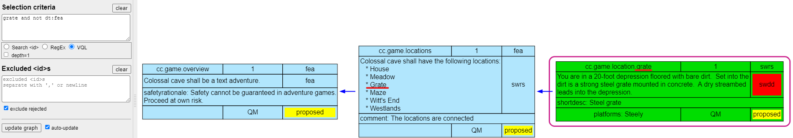

# Visual ReqM2 Query Language (VQL)

## Purpose

When Visual ReqM2 is rendering a diagram, a selection of the specobjects of interest
is crucial to get a relevant diagram displayed.

A new selection method, dubbed `Visual ReqM2 Query Language`, or `VQL` has been introduced.
It is one of three methods.
Depending on user feeback, the number of methods may be reduced in future releases.

| Method  | Description |
|:--------|:------------|
| \<id>   | A legacy method where the selection string is only matched against the \<id> field |
| Regex   | The common method used up to now. The selection is a [regular expression](https://www.w3schools.com/jsref/jsref_obj_regexp.asp), which is used to match against a tagged search string |
| VQL     | The new method described below. Simpler to use than Regular Expressions, but with features that make it more powerful |

How the selection is interpreted is controlled by the radiobuttons below the input box.
There are 3 mutually exclusive choices \<id>, RegEx and VQL.

(Previously there was a checkbox choosing between \<id> and RegEx).

### Simple selection

A simple selection is the enter the `<id>` of the specobject in the **Selection criteria**

It is also possible to select by simply entering words that occur in the relevant specobjects.
In below example the word `Meadow` occurs in one speobject, so it can be used as a search term.

If several words are specified, there is an implicit 'AND' between them, i.e. all words must
occur in the same specobject.
The 'AND' may also be spelled out, but is not necessary, as for example `meadow AND house`.
The order of the words does not matter for the final result.

The evaluation is from left-to-right, and subsequent test for 'house' are only done on specobjects known to contain 'meadow'. This is a performance optimization and is in most cases not relevant to consider.

### Scoping the selection to specific fields in specobject

Each specobject has a search string, where simple prefixes, derived from the XML schema,
prefix the various data items. Also a few synthesized attributes are present.

If you hover the mouse over the "Selection criteria" text, just over the input field, a tooltip will
appear with an overview of the available prefixes.

The curious can see the tagged search string for a specobject by right-clicking the object
and choosing `show search format`.

So to search for a 'grate' which is NOT in a specobject of doctype `fea`, simply type

`grate not dt:fea`

This could also be written as

`grate and not dt:fea`

this is because the 'and' operation is implied between terms.

Notice the RED outline (indicating what is selected) is only for the `swrs` object, not the `fea` object.

The `not` operator inverts the selection of `dt:fea` meaning **doctype** equal to `fea`

## VQL concept

VQL allows free ordering of search terms. For example to look for **approved** **swad** requirements
mentioning **calibration** or **adjustment**.

You could write this in several different ways

| expression                                                 | comment |
|:-----------------------------------------------------------|:--------|
| `dt:swad AND st:approved AND calibration\|adjustment`      | Regex expressions are still supported inside VQL terms |
|`dt:swad AND st:approved AND ( calibration OR adjustment )` | Brackets/parentheses `(` `)` can be used to group terms, but remember to put spaces around them |
|`dt:swad st:approved ( calibration OR adjustment )`         | The `AND` operator is optional |
|`calibration\|adjustment st:approved dt:swad`               | Omitted `AND` and compact regex |
|`st:approved ( calibration or adjustment ) dt:swad`         | Order of terms is not important |

Notice that order does not matter

## VQL operators

VQL support `AND` `OR` `NOT` operators and grouping with `(` `)`

Spaces are needed around the operators.

Additionally the hierarchical searches `children_of()` aka `co()` and `ancestors_of()` aka `ao()`
are available and have their own section below.

The operator hierarchy in descending order is: `NOT`, `AND`, `OR`. This is the same as in most
programming languages. Parentheses can be used to control evaluation order.

The `NOT` operator gives the complementary set. I.e. the nodes not matching the expression.
`NOT` can also be used in from of a bracketed search term like:

`id:maze not ( id:6 or id:8 )`

The above would match specobjects with 'maze' substring in the \<id> and no occurences of
digits '6' or '8' in the \<id>.

### Search terms are regular expressions

If we specify `dt:swrs` then we select the subset of specobjecs that have the `<doctype>` of `swrs`.
Additonal terms can be added `st:approved dt:swrs` to narrow the selection. There is an implied
AND betweeen the terms.

See [README.md search tags](../README.md#search-tags) for an overview of available tags.

A simple search term is just a partial string which should match to the specobjects.
It is possible to be more advanced and search for an \<id> containing multiple possibilities
`id:name-(foo|bar)` this will match `id:name-foo` or `id:name-bar`. To avoid matching a longer
id, which begins in the same way, the search term would be `id:name-(foo|bar)$`
Here `$` is a regex metacharacter indicating end-of-line, which would prevent matching of any longer strings.

You don't have to use regular expressions, the above could also be written as:

`id:name-foo or id:name-bar`

or 

`id:name-foo$ or id:name-bar$`

to force only complete matches and exclude prefix matches

### Use of regex metacharacters in ids

In VQL it is still possible (but not necessary) to use regular expressions in the search terms.

In some projects the naming of specobjects now include regex meta characters such as
 `(`, `)`, `[`, `]` etc.

To manage the use of meta characters, any VQL term which starts with `@` will have all meta
characters escaped.

In practice this means that looking for a specobject named

`ara.cli[StarterKit]--(ara.cli.StarterKit)`

instead is written as

`@id:ara.cli[StarterKit]--(ara.cli.StarterKit)`

Is is not possible to use regular expression syntax in '@' prefixed search terms. It is, however,
possible to use `$` to ensure match of a full name.

The author hopes that specobjects will not start to use `$` as part of the \<id>.

If for some reason the 1st character need to a `@`, like `@foo`, then write it as `@@foo` .

**Note**: When you right-click and 'select' a node, it is added to the selection criteria using the `@id:<id>$` format.

## Hirerarchical search

Suppose we want to find uncovered specobjects in a huge trace. There are many such specobjects,
but we want to limit it to specobjects which are children of some set of higher level specobjects.
To support this, VQL include the `children_of(term1,term2)` (can be abbreviated to `co(term1,term2)`).

1.  This seach starts by finding the specobjects selected by `term1`.
2.  Then the children of these specbjects are found.
3.  Finally the `term2` is applied on the children, which then gives the final result.

This effective limits the search to a sub-tree within the full trace.

Notice that `term1` can select one or more specobjects, so having groups of trees is possible.

A similar search can be done with `ancestors_of(term1,term2)` (can be abbreviated to `ao(term1,term2)`).
This finds related specobjects by following the 'uplinks'.

1. This search starts by finding the specobject selected by `term1`.
2. Then the ancestors of these specobjects are found.
3. Finally the `term2`is applied on the ancestors, which then gives the final result.

Notice that these operations can be nested and combined with `AND`, `OR` and `NOT` operations on search
terms, as well as grouping with `(` and `)`.
