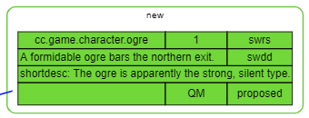
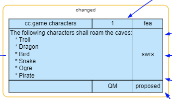
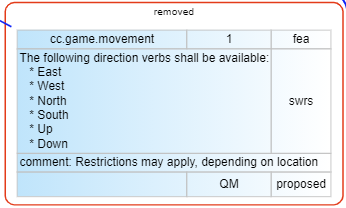
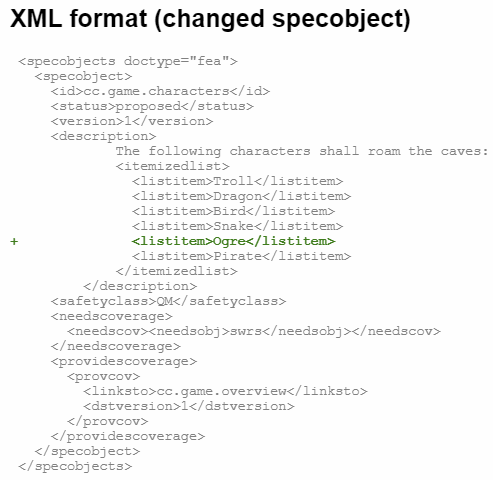
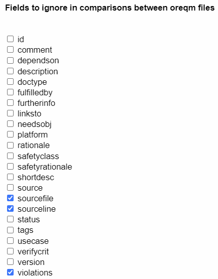
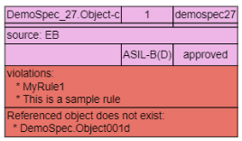

# Comparison View of oreqm files

Visual ReqM2 can display the diference between two `oreqm` files.
When a **reference** oreqm file is loaded, all the specobjects are compared to the **main**
`oreqm` file.

The internal representation of the **main** `oreqm` file is then modified in the following way:

1. Any specobjects whose `<id>`s are unique to the **main** `oreqm` file are marked as 'new'.
   This includes a green outline with the word 'new'.
   
2. Any specobjects where the `<id>` appear in both `oreqm` files, and which are not *identical*,
   (see definition of *identical* later) will be marked as 'changed'.
   
   The changed specobjects have an orange outline with the word 'changed'.
   
   
3. Any specobject whose `<id>` is unique to the **reference** `oreqm` file will be handled as 'removed'.
   Now, Visual ReqM2 is **visual**, which means the removed specobjects should be shown in some way.
   The removed specobjects are reintroduced as *ghost* specobjects in the internal representation of the
   main `oreqm` file. Ghosts are not really there but still are shown with a color that matches the doctype,
   but which fades to grey in a ghostly manner. Also a red outline with the word 'removed' is put around
   the specobject.

   

For changed specobjects, the XML view will display a git-style diff view. Right-click and select 'Show XML':

## Identical specobjects - a definition

A specobject from an oreqm contains plenty of information. When comparing the same specobject from
two different runs of ReqM2, there might be differences even though no meaningful change was done to
the specobject.

One such property is `<sourceline>`, which can change because of changes elsewhere. The same can
be argued for `<sourcefile>`, where moving a specobject from one file to another does not change
its meaning.
Therefore in Visual ReqM2 settings, it is possible to select which fields shall be ignored when
comparing `oreqm` files.

## Link changes
Visual ReqM2 does not display the links as text as part of specobject nodes, rather they are represented
as the edges (arrows) which connect the nodes of the graph. In case a specobject has a reference to
another non-existing specobject, the error message from ReqM2 is attached at the bottom of the
node with a red background.

For a diff view to be useful for review purposes, it should show all relevant changes clearly.
When it comes to showing changes in links, the following possibilities exist:

| Main\Ref | Link identical | Link added | Link removed |
| -------  | -------------- | ---------- | ------------ |
| Display  | Show as normal | Show **green** link | Link added back (*) and show as **red** link |

(*) Link is only added if destination node exists in either **main** or **reference** oreqm file.
If it exists only in **reference** file, the 'ghost' mechanism will make the specobject visible also in this diff view.

